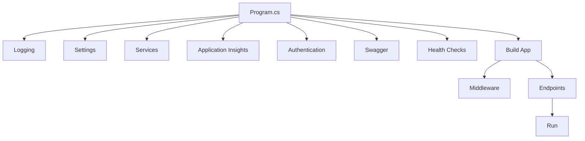

# Backend Program.cs Architecture

## Overview

The backend `Program.cs` has been refactored to improve maintainability and organization by extracting configuration logic into focused extension methods. This document describes the new architecture and how to work with it.

## Refactoring Summary

### Before
- **~270 lines** of configuration in a single Program.cs file
- Mixed concerns (logging, services, middleware, endpoints all in one place)
- Difficult to navigate and maintain

### After
- **~38 lines** in Program.cs with clear separation of concerns
- **9 extension method classes** organized by functionality
- **423 lines** of well-documented, focused extension methods
- Easy to understand, test, and maintain

## Extension Methods Structure

All extension methods are located in:
```
src/backend/dotnet/AzureDevOpsAI.Backend/Configuration/ServiceCollectionExtensions/
```

### 1. LoggingExtensions.cs
**Purpose**: Configure logging providers and filters

**Extension Method**: `AddLogging(WebApplicationBuilder)`

**Configuration**:
- Console and debug logging
- Minimum log level (Trace)
- Log filters for Microsoft, System, and AzureDevOpsAI namespaces

### 2. SettingsExtensions.cs
**Purpose**: Register all application settings from configuration

**Extension Method**: `AddAppSettings(IServiceCollection, IConfiguration)`

**Settings Registered**:
- `AppSettings` - General application configuration
- `AzureAuthSettings` - Azure authentication configuration
- `AzureDevOpsSettings` - Azure DevOps API configuration
- `ApplicationInsightsSettings` - Telemetry configuration
- `SecuritySettings` - Security and authentication settings
- `AzureOpenAISettings` - Azure OpenAI service configuration
- `CosmosDbSettings` - CosmosDB configuration

**Special Handling**:
- Automatically overrides `ClientId` with `ManagedIdentityClientId` environment variable for Azure OpenAI and CosmosDB settings

### 3. ApplicationServicesExtensions.cs
**Purpose**: Register application-specific services

**Extension Method**: `AddApplicationServices(IServiceCollection, IConfiguration)`

**Services Registered**:
- `ICosmosDbService` - CosmosDB data access (singleton)
- `IAIService` - AI service for chat processing (scoped)
- `IAzureDevOpsApiService` - Azure DevOps API client (scoped)
- `HttpClient` - HTTP client factory

**Validation**:
- Validates CosmosDB endpoint is configured at service construction time
- Allows test overrides for mocking

### 4. ApplicationInsightsExtensions.cs
**Purpose**: Configure Application Insights telemetry

**Extension Method**: `AddApplicationInsights(IServiceCollection, IConfiguration)`

**Behavior**:
- Adds Application Insights with connection string if provided
- Adds default Application Insights services without connection string (for local development)

### 5. AuthenticationExtensions.cs
**Purpose**: Configure authentication and authorization

**Extension Method**: `AddAuthenticationServices(IServiceCollection, IConfiguration)`

**Authentication Modes**:
- **Microsoft Identity Web** (production): When `AzureAuth` is configured and `Security:DisableAuth` is false
- **Basic JWT Bearer** (development): Fallback mode with configurable validation parameters

**Configuration**:
- Reads `AzureAuth` settings for tenant, client ID, and authority
- Reads `Security:DisableAuth` flag for testing/development

### 6. SwaggerExtensions.cs
**Purpose**: Configure Swagger/OpenAPI documentation

**Extension Method**: `AddSwaggerDocumentation(IServiceCollection, IConfiguration)`

**Features**:
- API documentation generation
- JWT Bearer authentication support in Swagger UI
- Conditional security definitions based on `Security:DisableAuth` setting

### 7. HealthCheckExtensions.cs
**Purpose**: Register health check services

**Extension Method**: `AddHealthCheckServices(IServiceCollection)`

**Health Checks**:
- `CosmosDbHealthCheck` - Validates CosmosDB connectivity
- `AzureOpenAIHealthCheck` - Validates Azure OpenAI service connectivity

**Tags**: Each health check is tagged for filtering (e.g., "db", "cosmosdb", "ready", "ai", "azureopenai")

### 8. MiddlewareExtensions.cs
**Purpose**: Configure HTTP request pipeline middleware

**Extension Method**: `UseApplicationMiddleware(WebApplication, IConfiguration)`

**Middleware Pipeline** (in order):
1. `RequestLoggingMiddleware` - Logs incoming requests
2. `ErrorHandlingMiddleware` - Global error handling
3. Swagger UI (development or when auth disabled)
4. `UseAuthentication()` - Authentication middleware (when enabled)
5. `UseAuthorization()` - Authorization middleware (when enabled)

### 9. EndpointExtensions.cs
**Purpose**: Map all HTTP endpoints

**Extension Method**: `MapApplicationEndpoints(WebApplication, IConfiguration)`

**Endpoints Mapped**:
- `GET /health` - Detailed health check with dependency status
- `GET /` - Root endpoint with API information
- `GET /health/ready` - Simple readiness probe for Kubernetes
- Chat endpoints via `MapChatEndpoints()`

## Program.cs Structure

The refactored `Program.cs` follows a clear, linear flow:

```csharp
using AzureDevOpsAI.Backend.Configuration;

var builder = WebApplication.CreateBuilder(args);

// Configure logging
builder.AddLogging();

// Add configuration settings
builder.Services.AddAppSettings(builder.Configuration);

// Add application services
builder.Services.AddApplicationServices(builder.Configuration);

// Add Application Insights
builder.Services.AddApplicationInsights(builder.Configuration);

// Add authentication
builder.Services.AddAuthenticationServices(builder.Configuration);

// Add Swagger/OpenAPI
builder.Services.AddSwaggerDocumentation(builder.Configuration);

// Add health checks
builder.Services.AddHealthCheckServices();

// Build the application
var app = builder.Build();

// Configure middleware pipeline
app.UseApplicationMiddleware(builder.Configuration);

// Map endpoints
app.MapApplicationEndpoints(builder.Configuration);

app.Run();

// Make Program class accessible for testing
public partial class Program { }
```

## Adding New Configuration

### Adding a New Service
1. Edit `ApplicationServicesExtensions.cs`
2. Add service registration in the `AddApplicationServices` method
3. Follow existing patterns (singleton vs. scoped vs. transient)

### Adding a New Setting
1. Add the settings class to `Configuration/AppSettings.cs`
2. Edit `SettingsExtensions.cs`
3. Add `Configure<YourSettings>()` call in `AddAppSettings` method

### Adding a New Middleware
1. Create middleware class in `Middleware/` directory
2. Edit `MiddlewareExtensions.cs`
3. Add `app.UseMiddleware<YourMiddleware>()` in `UseApplicationMiddleware` method

### Adding a New Endpoint
1. Create endpoint class in `Endpoints/` directory
2. Edit `EndpointExtensions.cs`
3. Map endpoints in `MapApplicationEndpoints` method

### Creating a New Extension Method Category
If you need a completely new category of configuration:

1. Create a new file in `Configuration/ServiceCollectionExtensions/`
2. Name it descriptively (e.g., `CachingExtensions.cs`)
3. Create a static class with extension methods
4. Add the method call in `Program.cs` in the appropriate order
5. Add tests in `AzureDevOpsAI.Backend.Tests/Configuration/`

## Testing

All extension methods are tested via:
- `ProgramRefactoringTests.cs` - Validates service registration and endpoint mapping
- Existing integration tests - Validates end-to-end functionality

Test pattern:
```csharp
[Fact]
public void Program_ShouldRegisterYourService()
{
    using var scope = _factory.Services.CreateScope();
    var service = scope.ServiceProvider.GetService<IYourService>();
    Assert.NotNull(service);
}
```

## Benefits of This Architecture

1. **Separation of Concerns**: Each extension method focuses on one aspect of configuration
2. **Testability**: Easy to test individual configuration pieces
3. **Maintainability**: Changes are isolated to specific extension files
4. **Readability**: Program.cs clearly shows what's configured without implementation details
5. **Reusability**: Extension methods can be reused in test scenarios
6. **Documentation**: Each extension method is self-documenting with XML comments

## Configuration Flow



## Related Files

- **Extension Methods**: `src/backend/dotnet/AzureDevOpsAI.Backend/Configuration/ServiceCollectionExtensions/`
- **Settings Classes**: `src/backend/dotnet/AzureDevOpsAI.Backend/Configuration/AppSettings.cs`
- **Tests**: `src/backend/dotnet/AzureDevOpsAI.Backend.Tests/Configuration/ProgramRefactoringTests.cs`
- **Services**: `src/backend/dotnet/AzureDevOpsAI.Backend/Services/`
- **Middleware**: `src/backend/dotnet/AzureDevOpsAI.Backend/Middleware/`
- **Endpoints**: `src/backend/dotnet/AzureDevOpsAI.Backend/Endpoints/`

## Migration Notes

### For Developers
- **No breaking changes**: All functionality remains the same
- **Configuration locations**: Settings are still in `appsettings.json` and environment variables
- **Service access**: All services are registered the same way as before
- **Testing**: Existing tests continue to work without modification

### For New Features
When adding new features, identify which extension method category they belong to and add configuration there. If no suitable category exists, create a new extension method file following the existing patterns.
